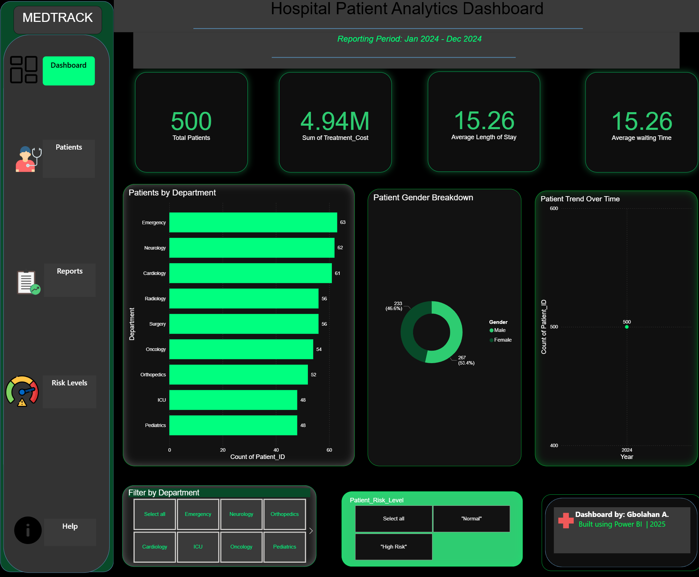
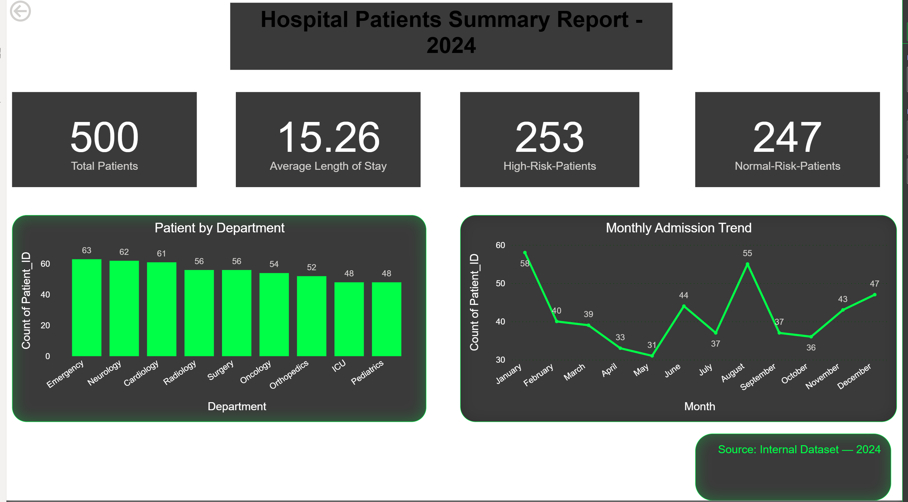
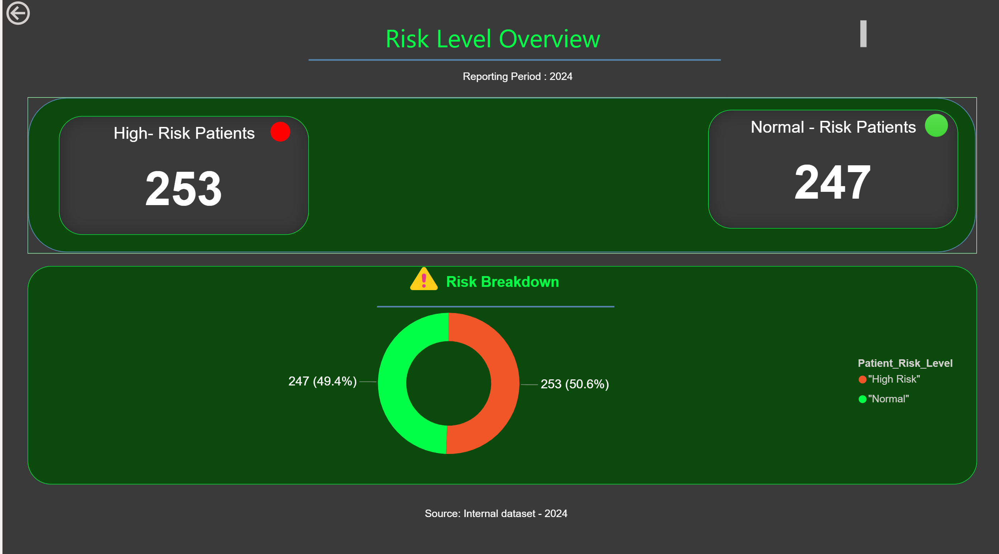

# 🏥 Healthcare Analytics Dashboard (Power BI)

This project analyzes hospital patient data to provide actionable insights on patient flow, waiting time, department utilization, and risk levels. The dashboard was built using *Power BI, applying data transformation using **Power Query*, visual analytics, and DAX measures.

---

## 🔍 Key Insights

- 📊 Total Patients Tracked: *500*
- 🧪 Highest Patient Load: *Emergency Department*
- ⏳ Average Length of Stay: *15.26 Days*
- 🚨 High-Risk vs Normal Patients Tracking

---

## 🛠 Tools & Skills Used

| Category | Tools |
|----------|-------|
| Visualization | Power BI |
| Data Cleaning | Power Query |
| Database | SQL (basic integration) |
| Logic | DAX Measures |
| File Management | GitHub |

---

## 📷 Dashboard Preview

| Page | Screenshot |
|------|------------|
| Main Dashboard |  |
| Patient Details |  |
| Reports |  |
| Risk Level |  |

---

## 📁 Download Project

You can download the .pbix file here to explore or test:

👉 *Healthcare Dashboard.pbix*

---

## 👤 Author

*Abodunrin Gbolahan — Aspiring Data Analyst*  
📍 United Kingdom  
🔗 GitHub Profile: https://github.com/Abodunrin-Gbolahan
